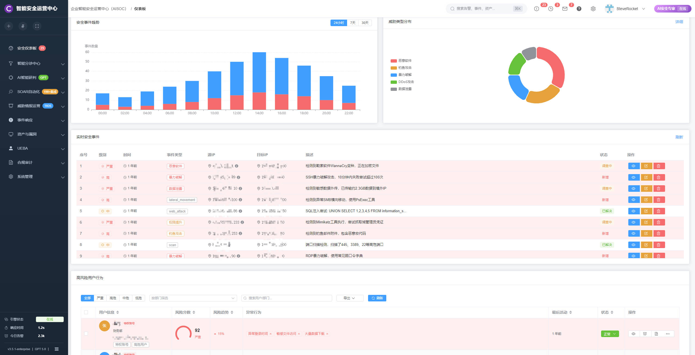
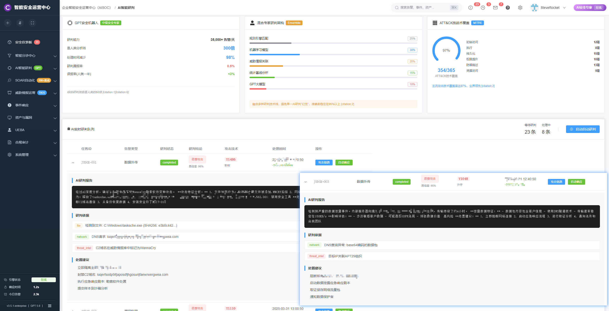
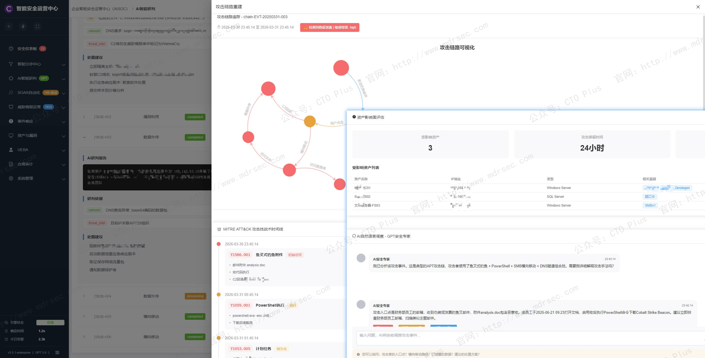
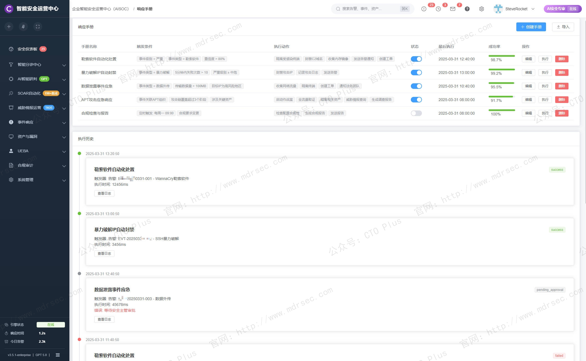
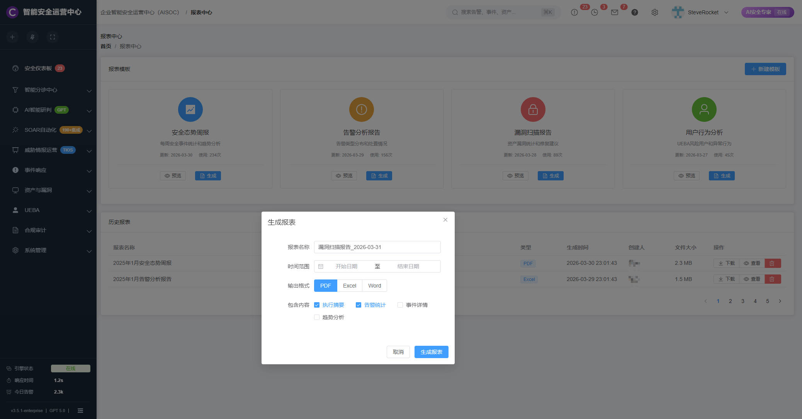
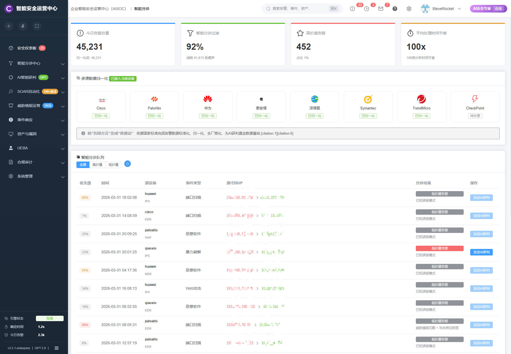

# 企业智能安全运营中心（AISOC）

## 关于我们

- 官网： http://www.mdrsec.com

我们的技术文章和产品概述欢迎浏览我们的门户。

- 公众号：CTO Plus

最新的动态欢迎关注我们官方唯一公众号。

- 作者QQ

更详细更具体的需求，或者项目合作，或者问题 欢迎联系我。

- QQ群

我们官方组建的QQ群，如果您有兴趣也可以加入我们。

- 请喝咖啡

如果感兴趣，也可以请我喝杯咖啡

## 产品核心功能模块

我们的AISOC以安全大模型与大数据关联引擎为双擎驱动，构建起涵盖智能告警研判、自动化事件调查、智能响应处置、攻击链可视化、自然语言狩猎、智能报告生成六大功能模块的完整体系。这里我将介绍下AISOC如何在真实攻防场景中实现MTTD秒级响应、告警准确率超93%、运营效率提升数十倍的突破性成效，并剖析其背后的五层协同研判架构、混合专家模型调度、安全知识图谱等关键核心技术支撑，促进企业安全运营体系的智能化升级。

过去十年，我们在企业进行实施安全建设遵循“纵深防御”理念，堆叠式部署了防火墙、WAF、IDS、EDR、SIEM等数十类安全设备。这套体系在合规层面看似完备，却在实战运营中暴露出结构性矛盾：日均百万级告警中真正有效的威胁不足1%，安全分析师深陷告警海洋，MTTD（平均检测时间）以小时计、MTTR（平均响应时间）以天计，而攻击者从突破边界到达成目的往往只需数小时。

问题的本质不在于“检测能力不足”，而在于“运营效率崩溃”。传统SOC（安全运营中心）将告警研判、事件调查、响应处置等核心环节建立在高度依赖专家经验的人力密集型模式上，这套模式在攻击手段快速迭代、攻击面持续扩张的今天已经难以为继。

我们的AISOC（AI-powered Security Operations Center，智能安全运营中心）并非传统SOC的简单升级，而是以大模型技术为底座、以智能体编排为手段的架构性重构——将AI能力系统性嵌入研判、调查、响应、报告、狩猎等全流程，让安全运营从“人驱动工具”转向“智能体驱动流程”。IDC预测，到2028年中国安全智能体相关应用市场规模将达16亿美元，年复合增长率超230%，AISOC正加速成为企业安全建设的主流方向 。

## 传统SOC的痛点分析

**痛点一：告警过载，真实威胁被淹没。** 安全设备各自为政，每日产生海量告警，其中充斥着大量扫描探测、业务误报、重复告警等噪声。安全团队被迫在“告警海洋”中人工筛选，不仅效率低下，更致命的是——当真正的高危告警混迹其中时，往往因注意力耗散而被遗漏。统计显示，传统SOC中分析师超过60%的时间消耗在处理无效告警上 。

**痛点二：研判依赖专家，经验难以规模化复制。** 告警研判高度依赖分析人员的个人经验，从载荷分析、上下文关联到攻击链还原，每个环节都需要深厚的攻防知识储备。而安全人才缺口持续扩大，专家经验难以沉淀为体系化能力，导致研判质量参差不齐，漏报误报难以避免。

**痛点三：响应滞后，防御速度追不上攻击速度。** 从发现告警到完成处置，传统模式需经历“研判→定级→通知→调查→处置→验证”的冗长链条，涉及多角色协同、跨系统操作。当攻击者已利用自动化工具实现分钟级横向移动时，防御侧仍处于“人工审批+手工操作”的低速运转状态，错失黄金响应窗口 。

**痛点四：数据孤岛林立，全局视野缺失。** 云、容器、微服务等现代基础设施高度动态复杂，安全数据分散在数十类异构设备中，缺乏统一的数据治理与关联分析能力。攻击者可以利用碎片化的防御盲区从容渗透，而防御方却困于“只见树木不见森林”的局部视角，无法构建完整的攻击叙事 。

**痛点五：处置动作割裂，难以形成闭环。** 即便威胁被准确识别，响应动作仍需人工登录不同设备执行封禁、隔离、拉黑等操作，策略创建依赖手动编写规则，处置效果无法自动验证。这种“研判-响应”的断裂使得安全运营始终停留在“发现问题”而非“解决问题”层面。

## 产品架构

我们的AISOC架构设计围绕一个核心理念展开：将AI能力从辅助工具升级为运营中枢，采用“安全大模型+大数据关联引擎”的双擎驱动架构，前者负责理解、推理与决策，后者负责海量数据的采集、存储与关联计算 。

**安全大模型层**：区别于通用大模型，AISOC搭载的安全垂域大模型基于百PB级安全私域知识库训练，经千人攻防专家团队实战微调，在威胁研判、攻击链推理、处置策略生成等专业任务上具备显著优势。300亿+参数规模在“智力”与“算力”间达到平衡，既保证推理深度又满足实时性要求 。

**大数据关联引擎层**：负责接入企业全量安全数据——覆盖网络流量、终端日志、应用审计、威胁情报等190余种设备与数据源，通过预置的2200+解析规则与1200+检测分析模型，实现异构数据的归一化治理与实时关联计算 。

**智能体编排层**：这是我们AISOC区别于传统SOC的关键创新。围绕研判、调查、响应、报告等运营场景，系统预置了一系列专业智能体，每个智能体封装了特定任务的专家经验与工具调用能力。更重要的是，用户可通过自然语言或可视化编排自定义智能体工作流，灵活适配企业特有的运营流程 。

**知识图谱层**：基于图存储与计算引擎，将告警、资产、进程、文件、人员、攻击手法等多元实体智能关联，构建资产图谱、攻击图谱、告警图谱，为攻击链还原与影响面评估提供全局视角 。

## 核心功能模块介绍

### 智能告警研判：从“告警洪流”到“精准锁定”

这是AISOC价值感知最直接的功能模块，也是运营效率提升的“第一道分水岭”。

**自动化降噪与聚合**：AISOC的降噪智能体基于AI对告警意图的深度理解，自动过滤由业务扫描、合规检查、已知误报等产生的无效告警，同时将源自同一攻击行为的时间分散告警、多设备重复告警进行智能聚合，将海量原始告警压缩为数量有限的“安全事件”。实战数据显示，AISOC可消除90%以上告警噪声，让分析师聚焦于1%的高价值威胁 。

**多层级协同研判架构**：过滤后的告警进入分层研判流水线。第一层基于规则的高速初筛过滤50%-60%已知误报；第二层由AI大模型对单条告警载荷进行深度语义分析，判断攻击是否成功；第三层通过工作流自动取证——如对Webshell上传告警自动抓取文件实体进行沙箱分析，实现“实锤定性”；第四层基于攻击源长周期行为画像进行模式判定；第五层通过反馈学习持续进化。五层协同确保研判结论既“准”又“稳” 。

**混合专家调度**：不同类型的告警适用不同的研判策略。AISOC采用混合专家架构，智能调度规则引擎、机器学习模型、大语言模型等多种技术栈——Web告警侧重载荷分析、IOC告警侧重情报匹配、行为告警侧重基线偏离——实现研判准确性与性能的全局最优。某基金公司部署AISOC后，研判准确率达97%，关键告警识别率100% 。

**效率量化对比**：在真实红队测试环境中，AISOC单条告警处理时间≤9秒，相比传统SOC的数十分钟至小时级实现跨越式提升；关键告警准确率达93.1%，较人工模式提升2.7倍 。

### 自动化事件调查：从“手工溯源”到“一键取证”

告警定性只是起点，真正考验运营能力的是“找全处置对象、还原攻击全貌”。AISOC将这一过程的效率提升至分钟级。

**引导式智能调查**：当事件触发后，AISOC以思维链推理方式主动推荐调查路径——该事件涉及哪些资产、攻击者可能执行了哪些后续动作、需要采集哪些证据。分析师无需手动编写查询语句，一键即可启动自动化取证流程，系统自动从海量日志中提取相关线索并串联成完整证据链 。

**攻击链智能重建**：AISOC基于ATT&CK框架，自动将分散的告警片段还原为从初始访问、执行、持久化到横向移动的完整攻击链路。在车企实战测试中，AISOC实现100%准确重建攻击路径，而传统SOC在此项任务上几乎完全依赖人工拼凑且存在大量盲区 。这一能力的价值在于：让防御方从“看见单点告警”升级为“看清攻击者意图”。

**上下文智能取证**：针对隐蔽性强的无载荷告警（如行为类告警、反弹Shell），AISOC自动触发定制化取证工作流——抓取进程树、命令历史、网络连接快照等上下文信息，交由AI进行综合行为分析，清晰区分恶意攻击与正常运维操作，从根本上消除“证据不足”导致的悬而未决 。

### 智能响应处置：从“人工操作”到“分钟闭环”

发现威胁只是手段，阻断威胁才是目的。AISOC将响应环节从“手动操作多设备”变革为“智能体自动编排”。

**处置建议智能推荐**：基于预训练的NIST应急响应框架，AISOC针对不同事件类型、不同攻击阶段自动推荐最优处置动作——遏制阶段优先隔离主机、根除阶段删除持久化项、恢复阶段验证系统完整性。系统会解释每项建议的技术原理与业务影响，辅助运营人员决策 。

**SOAR智能体编排**：AISOC内置AI-SOAR能力，支持将研判、取证、封禁、通知、验证等环节编排为自动化工作流。与传统的固定剧本不同，AI-SOAR可根据事件上下文动态调整执行路径——例如根据受影响资产的重要等级自动升级响应级别，或根据封禁效果自动触发二次验证。系统联动190余种安全设备，实现跨厂商、跨类型的统一处置 。

**策略智能优化**：AISOC可定期分析历史告警处置效果，结合业务基线识别存在误报或漏报的检测规则，自动推荐优化方案。分析师确认后系统可自动调整规则阈值或增补例外条件，形成“检测→处置→反馈→优化”的持续改进闭环 。

### 安全知识图谱：从“数据孤岛”到“全景视图”

数据关联能力决定运营的“视野广度”。AISOC通过知识图谱技术打破数据孤岛，构建全局安全视图。

**多维度实体关联**：将告警、资产、IP、域名、文件哈希、进程、用户、漏洞等实体基于攻击关系、所属关系、通信关系进行图建模。当任一节点出现异常时，图谱可快速辐射呈现受影响范围——一台服务器被攻陷后，攻击者访问了哪些数据库、横向移动至哪些网段、窃取了哪些账号凭证，一目了然 。

**ATT&CK技战术映射**：AISOC将检测到的攻击行为自动映射至MITRE ATT&CK框架的技战术ID。头部产品NGSOC已覆盖354项ATT&CK技术，流行技术覆盖率达97%，这意味着绝大多数已知攻击手法都能被结构化理解与关联，而非停留在孤立的告警描述层面 。

**资产风险全景可视**：将漏洞扫描、配置核查、威胁情报与资产信息融合呈现，构建“资产-漏洞-威胁”三维风险视图。管理者可直观了解哪些关键资产存在高危漏洞、哪些漏洞已有在野利用、哪些资产正遭受定向攻击，为风险治理提供决策依据。

### 自然语言智能狩猎：从“被动响应”到“主动发现”

传统威胁狩猎门槛极高——分析师需精通查询语法、理解底层数据结构、手动编写复杂关联规则。AISOC将这一过程“对话化”。

**假设驱动狩猎**：分析师只需用自然语言提出假设——“假设攻击者已利用Log4j漏洞进入内网，他们是否进行了横向移动？”AISOC智能体自主理解意图，将抽象假设拆解为具体查询任务，自动关联多源日志执行验证，将过去数小时的手工分析压缩至数分钟 。

**情报驱动狩猎**：当获取外部威胁情报后，分析师无需手动提取IOC逐条查询，只需问“这条情报涉及的技术我们内部有没有受影响？”系统自动抽象威胁特征，转化为狩猎命题并在全网数据中匹配攻击痕迹，大幅缩短从情报预警到内部排查的时间窗口 。

**异常驱动狩猎**：AISOC可理解“找出最近一周非工作时间的敏感数据访问”这类复合语义指令，综合时间特征、行为基线、用户画像进行智能判定，从海量日志中主动发现偏离基线的可疑行为，而非被动等待告警触发 。

### 智能报告生成：从“手工编写”到“自动叙事”

安全报告是运营成果的载体，也是向上沟通的工具。AISOC让这一费时费力的工作实现自动化。

**多受众差异化生成**：AISOC利用大模型的语言生成能力，针对不同受众自动生成差异化的报告版本——面向董事会侧重业务影响与风险态势，面向安全管理层侧重运营指标与资源缺口，面向一线分析师侧重技术细节与处置过程。每份报告均可评估合规风险、量化避免的经济损失，并推荐后续治理建议 。

**内生情报自动提取**：在调查过程中，AISOC自动识别未被收录的恶意IP、新型恶意文件等内生情报，提取至威胁情报库，实现“每起事件都是一次情报生产能力”的自我进化。这一机制让企业的威胁认知能力随运营时间增长而持续增强 。

**全程可审计追溯**：每条告警的处理过程——谁在何时做了何种研判、依据什么证据得出何种结论、执行了哪些处置动作——均生成完整记录与评估逻辑说明，确保运营工作的透明性与合规可审计性。在车企案例中，AISOC实现了每条警报100%可追溯，而传统SOC仅能部分覆盖且缺乏对应关系 。

## 关键特性

透过功能层面，我们的AISOC与传统SOC的本质差异体现在以下核心特性：

**实时性**：单条告警研判≤9秒，调查取证分钟级完成，响应处置近实时触发。这一特性得益于大模型推理加速技术与流式数据处理架构的结合，确保防御速度不再落后于攻击速度 。

**精准性**：关键告警准确率超93%、识别率100%，误报率显著低于人类分析师。精准性源于“垂域专模+混合专家调度+多层取证验证”的三重保障，让运营人员敢于将高频研判任务托管给AI 。

**全局性**：打破设备孤岛与数据孤岛，190+设备统一接入、354项ATT&CK技战术覆盖，从单点告警到攻击链还原，构建“全局一张图”的安全视野 。

**可进化性**：通过反馈学习与内生情报机制，AISOC能够随企业业务变化持续适配——运营人员的每次修正都在训练系统，每起事件都在丰富情报库，实现“越用越智能”的正向循环 。

**可审计性**：从告警到处置的每一步都留下可追溯的决策痕迹，满足合规审计与事件复盘的双重需求 。

**低门槛**：自然语言交互降低了对专业查询语法与底层数据结构的依赖，初级分析师也能完成复杂的调查与狩猎任务，有效缓解安全人才缺口压力。

## 落地实践：跨行业应用成效

我们自研的AISOC已在多行业头部客户中验证其价值：

**汽车制造业**：某全球豪华车企部署AISOC后，MTTD与研判定性时间从数十分钟级压缩至秒级，关键警报识别率提升2倍达100%，准确率提升近3倍达93%。在真实红队测试中，AISOC完整重建了传统SOC未能发现的攻击链，验证了其在复杂攻击场景下的实战能力 。
**金融行业**：某基金公司面临告警研判高度依赖人工、0day攻击无法检测的困境。部署AISOC后，研判准确率达97%，二次研判修正准确率接近100%，运营效率提升数倍。其五层协同研判架构确保了从海量告警中精准锁定有效威胁，同时自然语言狩猎功能赋予团队主动发现未知威胁的能力 。
**能源行业**：某能源企业在常态化运营与重保场景中，通过AISOC实现告警降噪超90%，建立“AI预判+人工复核”的高效研判模式，并将自动化处置流程沉淀为行业标准化模板，显著缩短响应时间 。
**央企客户**：某大型央企相关负责人评价：“AISOC对威胁的迅速响应、精准判断、全面信息呈现让我们眼前一亮，安全机器人的综合水平已与骨干运营人员不相上下，运营人员得以从繁琐基础工作中抽身，投入更具价值的主动防御。”

## 最后

AISOC的意义不仅在于提升单项效率指标，更在于重新定义了人机关系——AI不再是被动响应指令的工具，而是具备自主研判、主动推荐、持续学习能力的“数字分析师”。安全运营团队的角色从“告警消防员”转向“防御指挥官”，聚焦于策略制定、体系优化与高级狩猎等更高价值的活动。

我们的AISOC正从“创新探索”走向“规模化落地”。对于企业而言，启动AISOC建设需关注三个前置条件：一是安全数据基础——告警、日志、资产等核心数据的标准化接入是智能化的前提；二是场景适配——根据企业行业属性、攻击面特征定义智能体工作流，避免“开箱即用”的盲目期待；三是人机协同机制设计——明确哪些环节由AI自主决策、哪些环节保留人工干预，在效率与可控性间找到平衡。

更多功能模块和演示系统环境，如有需求和问题欢迎联系咨询我们。 http://www.mdrsec.com

## 产品清单

### 企业网络安全运营中心产品

- 资产安全配置管理系统（SCMDB）
- 终端侦测与响应系统（EDR）
- 网络侦测与响应系统（NDR）
- 企业网络资产攻击面管理系统（CAASM）
- 资产暴露面管理系统（AEMS）
- 网络安全蜜罐管理系统（HoneyPot）
- 安全事件收集与告警管理系统（SIEM）
- 扩展侦测与响应系统（XDR）
- 多引擎脆弱性扫描系统（VAS）
- 多源日志审计监测系统（LAS）
- 网络安全威胁情报中心（TIS）
- 网络安全漏洞库管理系统（VDBS）
- 网络安全编排与自动化响应（SOAR）
- 威胁狩猎系统（THS）
- 数据库安全审计系统（DSAS）
- AI智能体安全态势管理系统（AISPM）
- Web防火墙（WAF）
- 网站安全监测平台（WSM）
- 网络安全态势感知平台（SSAP）
- 网络安全自动化应急响应工具系统（NSRT）
- 企业网络安全运维工具系统（SecTools）
- 网络安全自动化等保测评系统（ASES）
- 浏览器安全监测防护系统（BSMPS）
- 网络安全用户实体行为分析系统（UEBA）
- 互联网电信诈骗预警防护系统（TPFWS）
- 云原生安全管理平台（CNAPP）
- 自动化渗透测试系统（PTS）
- 工业企业信息安全监测中心（IoT SOC）
- 企业智能安全运营中心（AISOC）

### 企业自动化运维产品

- 运维智能监控告警管理平台（AIMAMS）
- 企业网络工具系统（NTools）
- 自动化测试系统（AutoTest）
- 自动化运维系统（AutoOps）
- 企业运维工具系统（OpsTools）
- 物联网管理系统（IoTS）
- 软件开发生命周期管理系统（SDLC）
- IT流程管理系统（ITSM）

### 企业数字化运营资源管理系统产品

- 制造执行管理系统（MES）
- 运输管理系统（TMS）
- 跨境电商企业资源管理系统（ERP）
- 企业客户关系管理系统（CRM）
- 跨境电商仓库管理系统（WMS）
- 财务管理系统（FMS）
- 质量管理系统（QMS）
- 精准营销管理系统（PMS）
- 智能生产管理系统（SPMS）
- 电商BI系统（BI）
- 智能互联网分布式爬虫系统（AISpider）

## ABOUT

**【关于我们】**

* [主页：http://116.205.137.183/index_pro.html](http://116.205.137.183/index_pro.html)
* [Articulate v1.0](https://mp.weixin.qq.com/s/0yqGBPbOI6QxHqK17WxU8Q)
* [Articulate v2.0](https://mp.weixin.qq.com/s/V5Axn-ZWi22ubh5Jiocb9g)

 🥰

## Contact

  
**< 微信公众号 >**

  
**< QQ技术交流群 >**

**< 联系作者 >**

## **【代码工程系列】**

* [Python和Go的设计模式](https://github.com/zrf-rocket/DesignPattern)
    * GitHub：https://github.com/zrf-rocket/DesignPattern
    * Gitee：https://gitee.com/SteveRocket/design_pattern

* [Python、Go的编码技巧cookbook](https://github.com/zrf-rocket/CookBook)
    * GitHub：https://github.com/zrf-rocket/CookBook
    * Gitee：https://gitee.com/SteveRocket/cook-book

* [Go代码示例](https://github.com/zrf-rocket/PracticeGo)
    * GitHub：https://github.com/zrf-rocket/PracticeGo
    * Gitee：https://gitee.com/SteveRocket/practice_go

* [Python代码示例](https://github.com/zrf-rocket/PracticePython)
    * GitHub：https://github.com/zrf-rocket/PracticePython
    * Gitee：https://gitee.com/SteveRocket/practice_python

* [Python Web框架的示例代码](https://github.com/zrf-rocket/PythonFramework)
    * GitHub：https://github.com/zrf-rocket/PythonFramework
    * Gitee：https://gitee.com/SteveRocket/python_framework
    * Django：https://github.com/zrf-rocket/PythonFramework/tree/master/django_framework
    * Flask：https://github.com/zrf-rocket/PythonFramework/tree/master/flask_framework

* [Python 爬虫框架和技术](https://github.com/zrf-rocket/PracticeSpider)
    * GitHub：https://github.com/zrf-rocket/PracticeSpider
    * Gitee：https://gitee.com/SteveRocket/practice_spider

* [Rust代码示例](https://github.com/zrf-rocket/PracticeRust)
    * GitHub：https://github.com/zrf-rocket/PracticeRust
    * Gitee：https://gitee.com/SteveRocket/practice_rust

* [Vue代码示例](https://github.com/zrf-rocket/PracticeVue)
    * GitHub：https://github.com/zrf-rocket/PracticeVue
    * Gitee：https://gitee.com/SteveRocket/practice_vue

* [前端代码示例](https://github.com/zrf-rocket/PracticeFronted)
    * GitHub：https://github.com/zrf-rocket/PracticeFronted
    * Gitee：https://gitee.com/SteveRocket/practice_fronted

* [Python自动化测试框架](https://github.com/zrf-rocket/PythonTestAutomationFramework)
    * GitHub：https://github.com/zrf-rocket/PythonTestAutomationFramework
    * Gitee：https://gitee.com/SteveRocket/python_test_automation_framework

* [Python和Go的算法代码示例](https://github.com/zrf-rocket/Algorithms)
    * GitHub：https://github.com/zrf-rocket/Algorithms
    * Gitee：https://gitee.com/SteveRocket/Algorithms

* [Python和Go的数据结构代码示例](https://github.com/zrf-rocket/DataStructure)
    * GitHub：https://github.com/zrf-rocket/DataStructure
    * Gitee：https://gitee.com/SteveRocket/data_structure

* [编码规范](https://github.com/zrf-rocket/DevGuide)
    * GitHub：https://github.com/zrf-rocket/DevGuide
    * Gitee：https://gitee.com/SteveRocket/develop_guide

* [编码安全规范](https://github.com/zrf-rocket/SecGuide)
    * GitHub：https://github.com/zrf-rocket/SecGuide
    * Gitee：https://gitee.com/SteveRocket/security_guide

## **【产品系列】**

* [安全运营中心（SOC）-威胁情报与漏洞库管理系统](https://github.com/zrf-rocket/tip_platform)
    * GitHub：https://github.com/zrf-rocket/tip_platform
    * Gitee：https://gitee.com/SteveRocket/tip_platform

* [主机监控系统-日志收集与报警管理系统（SIEM）](https://github.com/zrf-rocket/SIEM)
    * GitHub：https://github.com/zrf-rocket/SIEM
    * Gitee：https://gitee.com/SteveRocket/siem

* [安全运营中心（SOC）-终端侦测与响应系统（EDR）](https://github.com/zrf-rocket/EDR_SOC)
    * GitHub：https://github.com/zrf-rocket/EDR_SOC
    * Gitee：https://gitee.com/SteveRocket/edr_soc

* [安全运营中心（SOC）-网络资产攻击面管理（Cyber asset attack surface management）系统](https://github.com/zrf-rocket/CAASM)
    * GitHub：https://github.com/zrf-rocket/CAASM
    * Gitee：https://gitee.com/SteveRocket/caasm

* [安全运营中心（SOC）-信息资产采集与安全评估系统（ICSA）](https://github.com/zrf-rocket/SOC_ICSA)
    * GitHub：https://github.com/zrf-rocket/SOC_ICSA
    * Gitee：https://gitee.com/SteveRocket/SOC_ICSA

* [安全运营中心（SOC）-安全编排与自动化响应（SOAR）](https://github.com/zrf-rocket/soar_platform)
    * GitHub：https://github.com/zrf-rocket/soar_platform
    * Gitee：https://gitee.com/SteveRocket/soar_platform

* [研发测试安全运维一体化平台（DevTestSecOps）](https://github.com/zrf-rocket/DevSecOps-SDLC)
    * GitHub：https://github.com/zrf-rocket/DevSecOps-SDLC
    * Gitee：https://gitee.com/SteveRocket/devsectestops-sdlc

* [安全运营中心（SOC）-Penetration Test-自动化渗透测试平台（PT-PenTest）](https://github.com/zrf-rocket/PenetrationTest)
    * GitHub：https://github.com/zrf-rocket/PenetrationTest
    * Gitee：https://gitee.com/SteveRocket/penetration_test

* [cicd-持续集成持续部署系统（CI/CD）](https://github.com/zrf-rocket/CICD)
    * GitHub：https://github.com/zrf-rocket/CICD
    * Gitee：https://gitee.com/SteveRocket/cicd

* [DevSecTestOps-SDLC-自动化研发安全测试运维一体化平台（DevSecTestOps）](https://github.com/zrf-rocket/DevSecOps-SDLC)
    * 代码自动构建、代码安全审计、自动测试、自动部署、自动接口测试
    * GitHub：https://github.com/zrf-rocket/DevSecOps-SDLC
    * Gitee：https://gitee.com/SteveRocket/dev-sec-ops-sdlc

* [AI图像识别-智能缺陷检测系统]()
    * [基于AI图像识别的工业缺陷检测应用系统（GPU&FPGA）](https://mp.weixin.qq.com/s/04qefQFg-Pg1Gcqq1vBLQQ)
    * [基于AI图像识别的智能缺陷检测系统，在钢铁行业的应用-技术方案](https://mp.weixin.qq.com/s/dSHbnuOwQZzE4CvPr1JYjg)

# CAASM 网络资产攻击面管理（Cyber asset attack surface management）和 EASM 外部攻击面管理（External attack surface management）系统

## 功能特性

## 架构图

